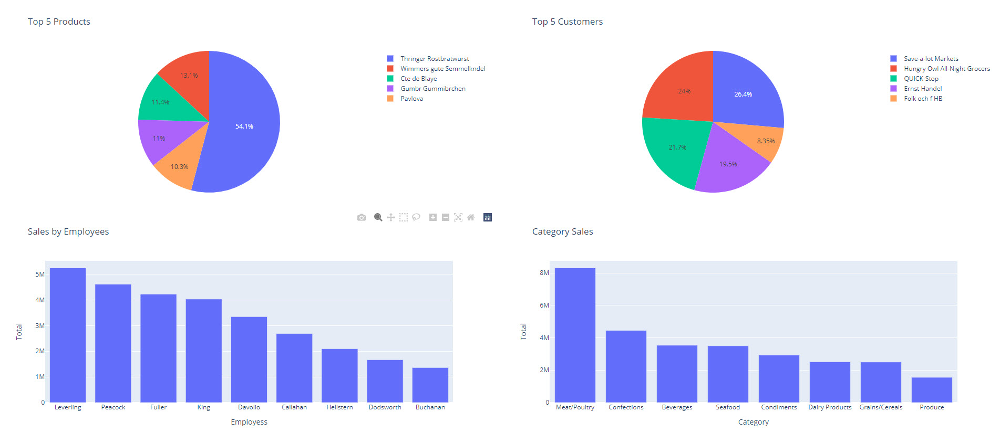

<!-- _color: white -->
# Python - Videregående <!-- fit -->
## Tue Hellstern

## Internet
- **Navn: comwellhotels**
- **Kode: comwellhotels**

----


# Tidsplan

- Kl. 17.00  –  Velkommen
- Kl. 18.15  –  Sandwich
- Kl. 19.45  –  Kaffe & kage
- Kl. 21.00  –  Spørgsmål + afrunding
- Kl. 21.30  –  Tak for i aften

---


# Tue Hellstern

- Uddannet fra ITU
- Ekstern lektor på DTU
- Lektor på KEA
- Censor på Datamatiker, Akademiuddannelserne, PBA, Økonomi & IT og andre uddannelser

### Konsulent
- Selvstændig siden 1995
- Programmering, Databaser, Integration, Projekt styring
- Typisk større virksomheder
---


# Agenda

- Introduktion til Visual Studio Code
- f-string
- If & Loop
- Virtual Environment
- Funktioner
- Fejl håndtering
- Databaser
- Klasser & Objekter
- Matplotlib
- Dash - Demo

---


# Hvem er I?

- Programmerings erfaring?
- Erfaring med Python?
- Erfaringer med Visual Studio Code? - Andet IDE?
- Jeg skal bruge Python til?

---

# Link til Filer
Samling af filer

Noget skal vi bruge noget er det vi kommer til at oprette

Link til zip fil: [bit.ly/ida-python-27062022](https://bit.ly/ida-python-27062022)

Denne præsentation: [bit.ly/ida27062022-pp](https://bit.ly/ida27062022-pp) 

---


# Visual Studio Code
Visual Studio Code, also commonly referred to as VS Code, is a source-code editor made by Microsoft for Windows, Linux and macOS.

Features include support for debugging, syntax highlighting, intelligent code completion, snippets, code refactoring, and embedded Git. Users can change the theme, keyboard shortcuts, preferences, and install extensions that add additional functionality.

In the Stack Overflow 2021 Developer Survey, **Visual Studio Code was ranked the most popular developer environment tool**, with 70% of 82.000 respondents reporting that they use it.

[code.visualstudio.com](https://code.visualstudio.com)
---


---

# f string
Fra Python 3 har det været muligt at bruge f-string.

```python
pris = 1366.1265

# .2f
print(f'Prisen er {pris:.2f}')
```

<!-- _footer: f-string.py -->

---


# Opgave - PI
## string / input
Skriv et Python-program, som modtager radius af en cirkel og udregner arealet af cirklen.

- Input skal være med 2 decimaler
- Output skal være formateret med 2 decimaler

<!-- _footer: pi-opgave.py --> 

---

# If
Når du vil udfører kode når en bestem betingelse er opfyldt skal du bruge **If…elif…else**

```python
if b > a:
  print("b er størrer end a")
elif a == b:
  print("a og b er ens")
else:
  print("a er størrer end b")
```

<!-- _footer: code_kontrolstruktur.py --> 

---


# Opgave - Find det største nummer
Skriv et program der finder det største tal ud af to tal som brugeren "skriver" (input)

<!-- _footer: find-storste-nr.py --> 

---

# Loop
Python har to forskellige loop metoder: 
- **while** loops
- **for** loops

```python
# while
i = 1
while i < 6:
print(i)
i += 1

# for
navne = ["Ole", "Per", "Ulla"]
for n in navne:
 print(n)
```

---


# while - Ur

```python
import time

while True:
  localtime = time.localtime()
  result = time.strftime("%I:%M:%S %p", localtime)
  print(result)
  time.sleep(1)
```

<!-- _footer: ur.py --> 

---


# Opgave - Positiv liste
Overfør alle de **positive** tal fra **liste1** til **liste2**

```python
liste1=[22, -5, 16, -45, -17, 19, 87, -10]
liste2=[]
```

Print indholdet af liste2

*Hint: Brug* **liste2.append(<værdi>)**

---


# Virtual Environment
Et Virtual Environment er en selvstændig installation af Python. Der indeholder en Python-installation med en version af Python, plus de moduler du installerer.

*Fra Python version 3 er Virtual Environment en del af Python installationen.*

---


# Kommandoer

- **Opret** - *Python3 -m venv mit_env*
- **Aktiver**
    - **macOS** – *source bin/activate*
    - **Windows** - *.\Scripts\activate*
- **Installere moduler** - *pip2 install navn*
- **Requirement file** - *pip3 install -r requirements.txt*
- **List moduler** - *python -m pip list*
- **Save moduler** - *pip3 freeze > requirements.txt*
- **Deaktivere** - *Deactivate*

---

# Funktioner
En funktion (*Function*) er en kode-blok, som du kan kalde fra din kode. Den bliver altså kun udført, når  den bliver kaldt. En funktion returnerer typisk et resultat/data.
- Du opretter en funktion ved at bruge **def**
- Du kalder/bruger en funktion ved at skrive navnet på funktionen

```python
# Opret funktionen
def min_funktion():
 print("Hej, jeg kommer fra en funktion")

# Brug funktionen
min_funktion()
```

<!-- _footer: funktioner.py --> 

---

# Functions som argument
```python
def add(n1, n2):
    return n1 + n2

def subtract(n1, n2):
    return n1 - n2

def multiply(n1, n2):
    return n1 * n2

def divide(n1, n2):
    return n1 / n2

def calculator(operation, n1, n2):
    return operation(n1, n2)

result = calculator(add, 10, 20)
print(result)
```

<!-- _footer: functions-argument.py --> 

---

# Recursion
Rekursion er den proces, hvor en funktion kalder sig selv under udførelse. Hvert rekursivt kald tager programmet et step dybere ind i funktionen.
```python
def printNumber(number):
    print(number)
    if number == 0:
        return 0
    printNumber(number - 1)  # Recursive kald

printNumber(5)
```

I denne funktionen udskriver vi først nummeret, reducerer derefter tallet med 1 og kalder funktionen igen. 

Når tallet når 0, stopper vi med at returnere værdien 0 i funktionen

<!-- _footer: demo-recursion.py -->

---


# Indbyggede funktioner
Python har nogle indbyggede funktioner.

Der er også nogle indbyggede attributter, alle Python klasser har.

---

# Import af Function
Det er muligt at afvikle en Function i en anden fil ved at importere denne.

```python
# Definition af min funktion
def my_function():
    print('Jeg kommer fra en funktion i "tuescript.py"')

# Afvikling af denne fil
if __name__ == "__main__":
    print('Hvis afviklet direkte fra tuespript.py - __name__ = ' + __name__ )
else:
    print('Hvis afviklet via import - __name__ = ' + __name__)
```

<!-- _footer: tuescript.py -->

---

# Import af tuescript.py
```python
import tuescript

# Afvikling af funktionen my_function i tuescript
tuescript.my_function()


# Afvikling af denne fil
if __name__ == "__main__":
    print ('Hvis afviklet direkte fra Function_name.py - __name__ = ' + __name__ )
else:
    print ('Hvis afviklet via import - __name__ = ' + __name__)
```

<!-- _footer: Function_name.py -->

---


# Opgave - Function - Tips
Du skal oprette en funktion der kan udregnet hvor meget du skal betale, når du giver drikkepenge (tip).

- Drikkepenge skal angives som: 10 der så er 10%
- Drikkepenge skal have en standardværdi på 10%
- Total beløbet skal angives med 2 decimaler

```python
total_betaling(100) # Standard 10%
total_betaling(100, 10.5)
```


<!-- _footer: tip-function.py -->

---


# Filer
Python har flere funktioner til **creating**, **reading**, **updating**, og **deleting** filer.

Du udføre de fleste filmanipulationen ved hjælp af et "*file object*".

---

# File Handling
Python har flere funktioner til **creating**, **reading**, **updating**, og **deleting** filer.

Det er Python funktionen **open()** du skal bruge

**open()** funktionen brugere to parameterer

- **filename**
- **mode**

Der er 4 forskellige - *modes*

- **r** - *Read*
- **a** - *Append*
- **w** - *Write*
- **x** - *Create*

---

## read file - r
```python
f = open("demofile.txt", "r")
print(f.read())
```

## append - a
```python
f = open("demofile.txt", "a")
f.write("Her kommer noget tekst")
f.close()
```

## overwrite - w
```python
f = open("demofile.txt", "w")
f.write("Ny tekst")
f.close()
```

---

# create file
- **x** - Opret en ny fil, *returnere en fejl hvis filen eksistere*
- **a** - Opretter filen, *hvis den ikke eksistere*
- **w** -  Opretter filen, *hvis den ikke findes*

## overwrite - w
```python
f = open("demofile.txt", "x")
f = open("demofile.txt", "a")
f = open("demofile.txt", "w")
```

---

## Slet en fil
For at slette en fil skal du bruge **OS** modulet.

```python
import os

os.remove("demofile.txt")
```

## Slet en mappe
```python
import os

os.rmdir("mappe-navn")
```

*Det er kun muligt at slette tomme mapper!*

---

# Check om en fil findes og slet den
Brug **os.path.exists("filnavn.txt")** til at se om filen findes

```python
import os

if os.path.exists("demofile.txt"):
  os.remove("demofile.txt")
else:
  print("Filen findes ikke!")
```

---

# Fejl håndtering
Fejl håndteringen i Python er opbygget af følgende:
- **try** – *Tester koden for fejl*
- **except** – *Kodeblok, der håndterer fejlen*
- **else** – *Kodeblok, der afvikles, når der ikke er nogle fejl*
- **finally** – *Kodeblok der bliver afviklet, uanset om der opstår en fejl eller ikke*

Når der opstår en fejl, eller undtagelse, vil Python normalt stoppe og generere en fejlmeddelelse

---

# Eksempel

```python
try:
  f = open('demofile.txt')
  try:
    f.write('Noget tekst')
  except:
    print('Kunne ikke skrive til filen')
  finally:
    f.close()
except:
  print('Kunne ikke åbne filen')
```

<!-- _footer: fejl.py --> 

---

# Databaser
Det er muligt at forbinde til de fleste typer af databaser fra Python.
Som eksempel kommer vi til at bruge en MySQL database, der er hosted på Azure.

Forbindelsen til databasen er opdelt i følgende filer:
- config.ini
- MysqlData.py

---

# config.ini

- host = tueh-sigel-mysql-server.mysql.database.azure.com
- user = hellstern@tueh-sigel-mysql-server
- password = IDASeminar2022
- database = northwind

```ini
[mysqlini]
conn_string = mysql://hellstern@tueh-sigel-mysql-server:IDASeminar2022@tueh-sigel-mysql-server.mysql.database.azure.com/northwind
```

*Disse login værdier virker kun i dag!*

<!-- _footer: config.ini -->

---

# MysqlData.py (Over 2 slides)
```python
# Import
from sqlalchemy import create_engine, exc
import pandas as pd
import configparser

# MySQL connection
def connect():
    db_conn = None
    try:
        # Read config.ini file
        config = configparser.ConfigParser()
        config.read('config.ini')

        # Connect to MySQL
        db_connection_str = config['mysqlini']['conn_string']
        db_conn = create_engine(db_connection_str)
        
        return db_conn

    except exc.SQLAlchemyError as e:
        print(e)

```

<!-- _footer: MysqlData.py -->

---

```python
# CategorySale
def getCategorySale():
    conn = connect()
    CategorySale = pd.read_sql('SELECT * FROM CategorySale', conn)
    return CategorySale

# Top5Products
def getTop5Products():
    conn = connect()
    Top5Product = pd.read_sql('SELECT * FROM Top5Products', conn)
    return Top5Product

# Top5Customers
def getTop5Customers():
    conn = connect()
    Top5Customers = pd.read_sql('SELECT * FROM Top5Customers', conn)
    return Top5Customers

# Get all data
def getdata():
    print(getCategorySale())
    print(getTop5Products())
    print(getTop5Customers())

if __name__ == '__main__':
    getdata()
```

<!-- _footer: MysqlData.py -->

---

# Matplotlib
Matplotlib er et meget brugt "*plot modul*" til Python.

Matplotlib er open source.

```python
import matplotlib

print(matplotlib.__version__)
```

Hvis du vil se plot er det nødvendigt at installere PyQt5

```python
pip3 install PyQt5
```

Se mere på [pypi.org/project/PyQt5](https://pypi.org/project/PyQt5)

---


# Pyplot
De fleste af Matplotlib-værktøjerne ligger under **Pyplot** og importeres normalt med **plt** aliaset.

```python
import matplotlib.pyplot as plt
import numpy as np

xpoints = np.array([0, 6])
ypoints = np.array([0, 250])

plt.plot(xpoints, ypoints)

# Vis plot
plt.show()

# Gem plot
plt.savefig('demoplot.png')
```

<!-- _footer: pyplot-1.py -->

---


# Bar plot
Med **Pyplot** kan du bruge **bar()** til at oprette søjlediagrammer:

```python
import matplotlib.pyplot as plt
import numpy as np

x = np.array(["A", "B", "C", "D"])
y = np.array([3, 8, 1, 10])

plt.bar(x,y)
plt.show()
```

<!-- _footer: pyplot-bar.py -->

---


# Histogram
**hist()** vil vise et histogram

```python
import matplotlib.pyplot as plt
import numpy as np

x = np.random.normal(170, 10, 250)

plt.hist(x)
plt.show()
```

<!-- _footer: plot-hist.py -->

---


# Pie plot
**pie()** vil vise et Pie plot

```python
import matplotlib.pyplot as plt
import numpy as np

y = np.array([35, 25, 25, 15])

plt.pie(y)
plt.show()
```

<!-- _footer: plot-pie.py -->

---


# Punkt plot - scatter
**scatter()** opretter et punktplot

**scatter()** plotter en prik for hver observation. **scatter()** brugere to arrays af samme længde, en for værdierne af x-aksen og en for værdier på y-aksen

```python
import matplotlib.pyplot as plt
import numpy as np

x = np.array([5,7,8,7,2,17,2,9,4,11,12,9,6])
y = np.array([99,86,87,88,111,86,103,87,94,78,77,85,86])

plt.scatter(x, y)
plt.show()
```

<!-- _footer: punkt.py -->

---


# Titler og Grid
Du kan også tilføje Titler og Grid

```python
import numpy as np
import matplotlib.pyplot as plt

x = np.array([80, 85, 90, 95, 100, 105, 110, 115, 120, 125])
y = np.array([240, 250, 260, 270, 280, 290, 300, 310, 320, 330])

plt.plot(x, y)

# Titler
plt.title("Aktivitet og kalorier")
plt.xlabel("Plus gennemsnit")
plt.ylabel("Kalorier")

# Grid
plt.grid()

plt.show()
```

<!-- _footer: label-plot.py -->

---

# Klasser & Objekter
Python er et objektorienteret programmeringssprog. 
Næsten alt i Python er et objekt, som ”indeholder” egenskaber og metoder.
En klasse er en ”constructor” eller en "blueprint" til at oprette objekter.

## Opret en Klasse
Du skal bruge class til at oprette en klasse.

```python
class MinNyeKlasse:
 x = 10
 ```
---

# Opret et Objekt
Når du har oprettet en klasse, kan du oprette objekter i denne klasse.

```python
o1 = MinNyeKlasse()
print(o1.x)
```

---

# Klasse eksempel - Medarbejder

```python
class Medarbejder:
 def __init__(self, navn, afdeling):
 self.navn = navn
 self.afdeling = afdeling

m1 = Medarbejder('Ole', 'Salg')

print(m1.navn)
print(m1.afdeling)
```

---


# Indbyggede funktioner
Python har nogle indbyggede funktioner.
Der er også nogle indbyggede attributter, alle Python klasser har:

---


# Dash demo

<!-- _footer: DashDemo.py -->