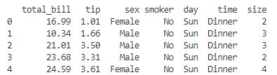
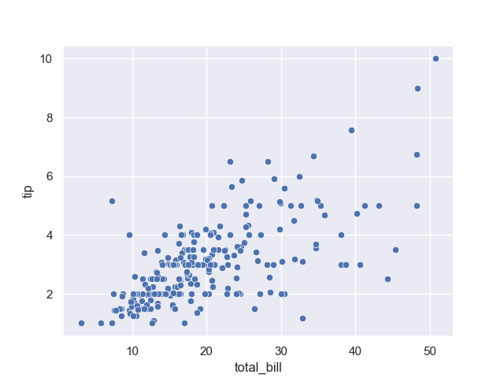
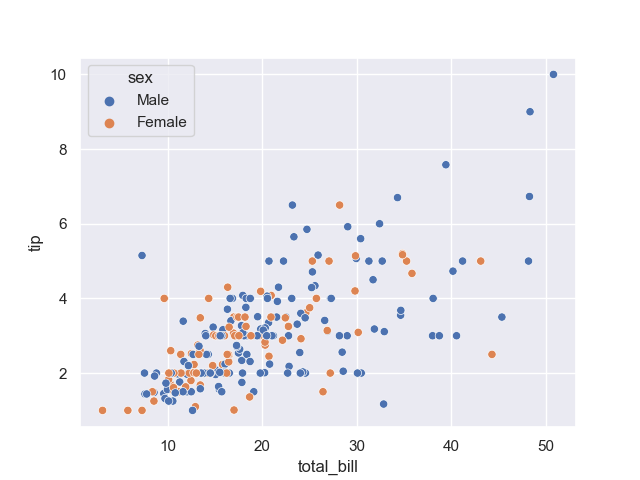
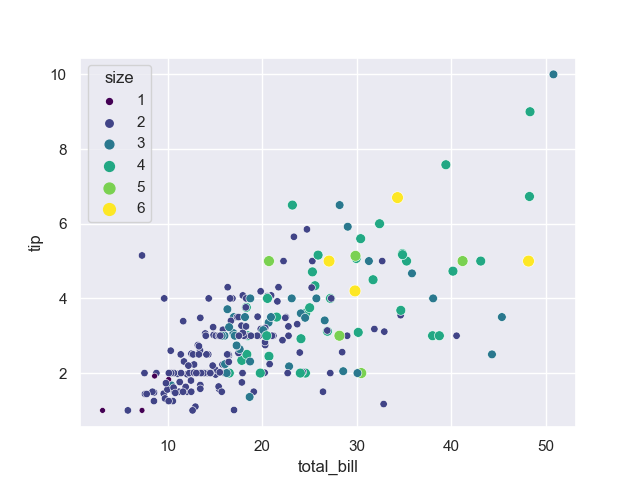
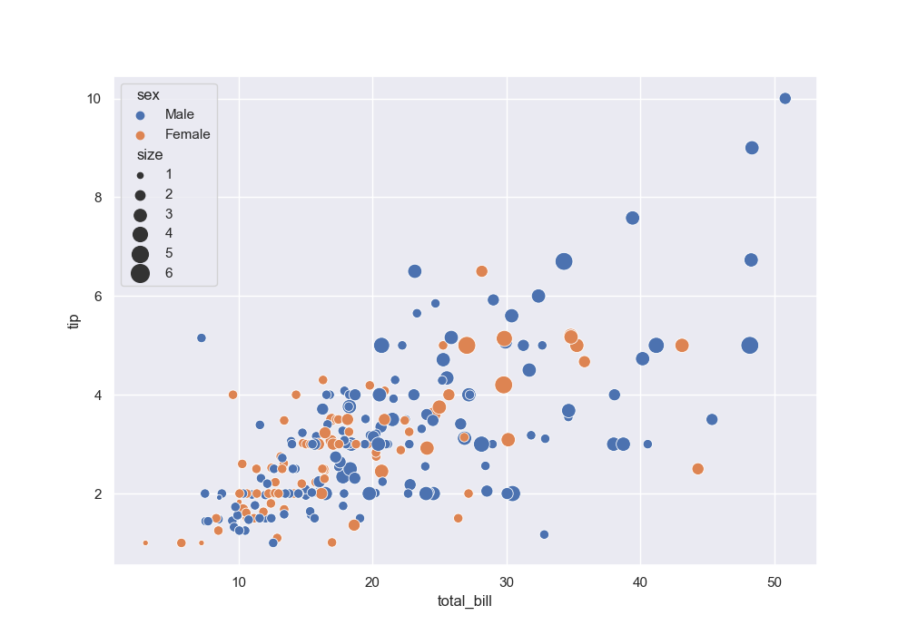
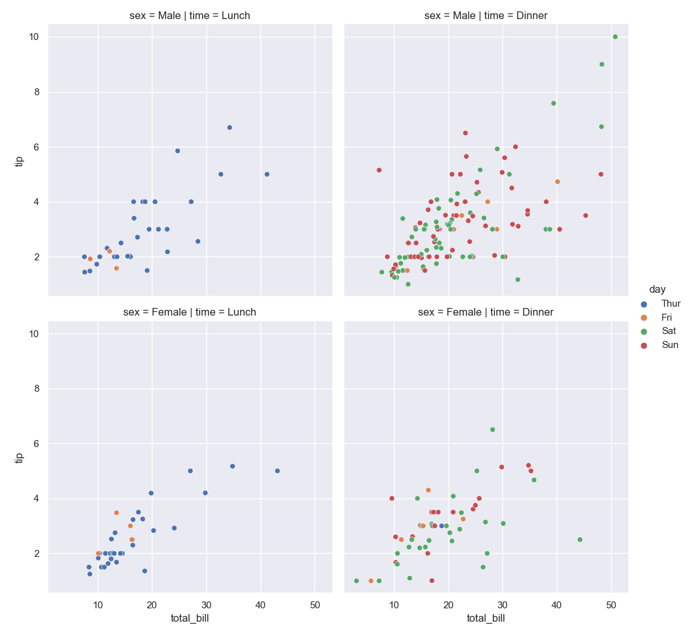

[Home](../modul-4-2.md)

<details open markdown="block">
  <summary>
    Table of contents
  </summary>
  {: .text-delta }
1. TOC
{:toc}
</details>

# Plot med Seaborn


## Seaborn
>   Seaborn is a Python data visualization library based on matplotlib. It provides a high-level interface for drawing attractive and informative statistical graphics.


# Imports
Vi skal bruge følgende moduler

```python
import pandas as pd
from matplotlib import pyplot as plt
import seaborn as sns
```

# Plot theme
Du kan bruge forskellige standard plot temaer, Seaborn har 5 af disse temaer:

- white
- dark
- whitegrid
- darkgrid
- ticks

Du skab bruge kommandoen set_style() for at sætte temaet du vil bruge.

```python
sns.set(style='darkgrid')
```

# Data
Vi bruger et standard Seaborn dataset, der indeholder "*tips data*". Det kan importeres direkte fra Seaborn

```python
tips = sns.load_dataset('tips')
print(tips.head())
```



# Bar plot
Hvordan fordeler omsætningen (*total_bill*) sig over de forskellige ugedage.

```python
sns.barplot(x='day', y='total_bill', data=tips)
plt.show()
```

## Python file
Du kan hente min Bar plot Python fil [her](./_code/plot_bar.py)

# Scatter plot
I et Scatter plot viser prikker værdierne af to separate numeriske variable på x-aksen og y-aksen. 

Scatterplot er essentielle i statistik, fordi de kan vise styrken af ​​en korrelation mellem to variable (*X og Y*).

- Det viser sammenhængen (*positiv og negativ*) og tendensen mellem de to variable.
- Det hjælper med at finde minimum, maksimum og outliers.
- Det viser, hvor meget en variabel påvirker en anden variabel.
- Det hjælper dig med at forudsige adfærden af ​​en variabel (*en afhængig variabel*) afhængigt af målingen af ​​den anden variabel (*uafhængig*)

## Plot
For at oprette et Scatter plot skal du bruge 2 numeriske kolonner, x- og y-akserne.

Det viser en positiv sammenhæng, da vi kan se, at ved at øge det samlede beløb (*total_bill*) stiger drikkepengene (*tip*) også.

```python
sns.scatterplot(x='total_bill', y='tip', data=tips)
plt.show()
```

Du skal bruge kommandoen **plt.show()** for at få vist dit plot.



# Hue
Du kan bruge farver (*Hue)* til at difference mellem køn (*Male/Female*).

```python
sns.scatterplot(x='total_bill', y='tip', data=tips, hue='sex')
plt.show()
```



# Size
Der er fem unikke værdier (*1, 2, 3, 4, 5, 6*) i "**size**" kolonnen, vi vil gerne have vist seks forskellige farver med forskellige størrelser (*1 til 6*).

```python
tips['size'].unique()
sns.scatterplot(x='total_bill', y='tip', data=tips, hue='size', size='size', palette='viridis')
plt.show()
```



# Hue og Size
Vi kan kombinere de to plot, *Hue* og *Size*.

- **Hue** sætter vi til køn
- **Size** sætter vi til 6 størrelser. Størelsen sætter vi til at være i intervallet 20, 200.

```python
plt.figure(figsize=(10,7))
sns.scatterplot(x='total_bill', y='tip', data=tips, hue='sex', size='size', sizes=(20,200))
plt.show()
```



# FacetGrid
Du kan bruge funktionen, **relplot**, til at kombinere *Scatterplot* og *FacetGrid*.

FacetGrid tager en dataframe som input og navnene på variabler, der udgør gitterets række-, kolonne- eller farver

```python
sns.relplot(x='total_bill', y='tip', data=tips, hue='day', col='time', row='sex')
plt.show()
```



## Python file
Du kan hente min Scatter plot Python fil [her](./_code/plot_scatter.py)